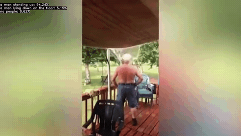

# fall-detection
Rough Fall detector using [CLIP](https://github.com/openai/CLIP) for context prediction


## Introduction
This is an artifact of a past academic project for IOT applications. However, it was finished as a proof-of-concept, and as such is in a very crude state. There are many improvements I felt could've been made back then, so feel free to extend upon the barebones I have done here.

## Requirements
If you haven't already, install [CLIP](https://github.com/openai/CLIP) and its dependencies, as well as opencv2 for python 3 (ideally version >4.0).

I'd also recommend a pinch of garnish to make the ancient texts I wrote 4 years ago more palatable.

## Usage
The original demo program is provided in `demo_local.py`, you can run it via
```
python demo_local.py
```
Or with a given video file
```
python demo_local.py -i [path to file]
```

## Known Caveats
This detection method depends on the camera/view perspective being  upright. A high-angle top-down view doesn't work most of the time. Similarly, if the subject is obscured or occluded in the frame then they won't be detected. 

There is no spatial seperation, so a match (including false ones) anywhere in the frame will have the same result. This does make it more sensitive to false matches as they can erroneously trip a detection anywhere in the image.

Most importantly however, the state of lying down and having fallen down are ambigious without temporal information, and this detection method does not address that. 
There are other detection algorithms that process temporal information, and it would be good to explore those too for future work.

## See Also
[OpenCLIP](https://github.com/mlfoundations/open_clip): A newer collection of CLIP models including ViTs